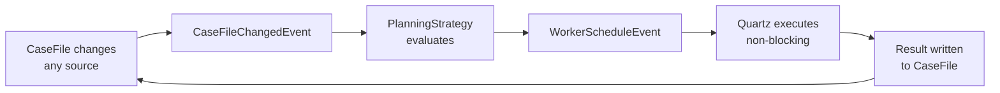

# Two CaseHubs, One Design

**Date:** 2026-04-09
**Type:** phase-update

---

## Where this started

A colleague had been working on a CMMN-inspired implementation for agentic AI — casehub-engine. Good work, progressing well. I wanted to understand the space more deeply myself, partly to get a clearer picture of what he was building, partly so I could direct him more precisely toward the broader architectural concepts I had in mind.

I started some exploratory work with Claude. What I didn't expect was how quickly it would build out an entire system. What began as exploration to improve my own understanding turned into something of real value in its own right — a working framework built across just three sessions, starting from Blackboard Architecture and evolving to incorporate CMMN concepts, as discussed in the earlier posts in this series.

That created an interesting situation. Two implementations now exist. Both have real value. Getting the best of both requires careful work — not a simple merge but a deliberate synthesis of the strongest ideas from each. This post is about that synthesis.

First, what those three sessions actually produced.

---

## What three sessions produced

Before getting to today's work, it's worth being precise about what the previous three sessions actually built — because the scope still surprises me when I look at it.

**Session 1 — March 27, one commit, 2:33am**
- Full Blackboard control loop: `CaseEngine`, `CasePlanModel`, `PlanItem`, `PlanningStrategy`
- `CaseFile` with per-key versioning, optimistic concurrency, change listeners, contribution tracking
- `TaskDefinition` with DFS cycle detection preventing circular dependencies at registration
- Complete resilience layer: `RetryPolicy`, `PoisonPillDetector`, `DeadLetterQueue`, `IdempotencyService`, `TimeoutEnforcer`, `ConflictResolver`
- `TaskBroker`, `TaskScheduler`, `WorkerRegistry` with autonomous worker support
- SPI interfaces for storage — `CaseFileStorageProvider`, `TaskStorageProvider`
- Two working example applications, LLM worker integration
- 2,400-line design document
- **73 files, 14,003 lines**

**Session 2 — March 28**
- CMMN Stage lifecycle — nested stages, autocomplete, manual activation, entry/exit criteria
- CMMN Milestones — named achievement markers, `PENDING`/`ACHIEVED`
- In-memory storage providers — fast, zero-dependency tests
- Quarkus Flow bridge — `FlowWorker`, `FlowWorkflowRegistry`, `FlowExecutionContext`

**Session 3 — April 9**
- POJO graph refactor — `CaseFile.getParentCase/getChildCases`, `Task.getOwningCase/getChildTasks`
- `PropagationContext` slimmed to W3C traceId + attributes + budget
- `CaseFileRepository` + `TaskRepository` SPIs extracted to dedicated modules
- `casehub-persistence-memory` and `casehub-persistence-hibernate` modules
- Goal model research across GOAP, BDI, HTN, DCR, CMMN, KAOS, LangChain4j — ADR-0001 written
- GitHub repository, issue tracking, retrospective mapping

Three sessions. The framework was real and working. Then I looked at what my colleague had been building in parallel.

---

## The other implementation

My colleague had been building casehub-engine independently. Different architectural choices throughout: a reactive event bus (Vert.x + Mutiny), JQ expressions for conditions, Quartz for durable worker execution, a YAML/JSON schema with codegen, and a Goal model that was already implemented.

The question wasn't whether to merge — it was which direction and how.

Claude and I started with a surface comparison. Claude's first pass was useful but incomplete — it missed that casehub-engine's Workers already support plain Java lambdas alongside JQ expressions, reported `PropagationContext` as removed when it had only been slimmed, and initially underestimated the significance of the `EventLog`. I pushed for a systematic review — every file in both codebases, nothing skimmed. That's what surfaced `evalObjectTemplate()`, a full template mini-DSL for input/output mapping that doesn't use JQ at all.

---

## What each system brings

| **casehub** | **casehub-engine** |
|---|---|
| Blackboard control loop | Reactive async — Vert.x EventBus + Mutiny |
| `PlanningStrategy` — pluggable control reasoning | Goal + `GoalExpression` + `GoalKind` |
| CMMN Stage lifecycle — nested, autocomplete | `EventLog` — full ordered event history |
| Full resilience suite — DLQ, PoisonPill, Idempotency | Binding + Trigger — contextChange, cloudEvent, schedule |
| Hybrid orchestration + choreography | Capability + input/output mapping |
| Per-key versioning + `ConflictResolver` | YAML/JSON schema + codegen |
| `PropagationContext` — tracing + budget | Durable execution via Quartz |
| Persistence SPI — memory + Hibernate | — |

The gap runs in both directions — each system has capabilities the other lacks entirely.

---

## The direction: casehub as the base

casehub-engine's contributions are interface design and infrastructure — additive. casehub's contributions are architectural — the Blackboard control loop, CMMN stages, resilience, lineage. Starting from casehub-engine would mean rebuilding everything casehub already has. Starting from casehub means adopting casehub-engine's better surface design incrementally.

The merge direction was clear. The approach: evolve casehub in place, phase by phase.

---

## The async question: making the case for a hybrid event-driven PlanningStrategy loop

The most important architectural discussion was about the synchronous control loop.

casehub currently runs a blocking `while` loop: evaluate → fire one task → re-evaluate. casehub-engine is fully async — Vert.x event bus, Mutiny, everything non-blocking. The instinct was to frame this as sync vs async. That's the wrong frame.

The real question is two separate things: who decides what fires next, and does execution block threads? casehub conflates them. A PlanningStrategy that reasons sequentially about what should run next does not require blocking threads. The loop can be event-driven: a `CaseFileChangedEvent` fires on the bus, the strategy evaluates, a `WorkerScheduleEvent` is published, Quartz picks it up. Sequential logic, non-blocking execution.

More importantly: the synchronous loop can't handle casehub's own hybrid model cleanly. Autonomous workers run on their own threads and currently reach back into the engine via `notifyAutonomousWork()` — coupling workers to engine internals. With an event bus, autonomous workers just write to the `CaseFile`. The engine reacts. Same as everything else.

Async isn't a performance improvement here. It's architecturally necessary for the hybrid model to work cleanly.

---

## Key decisions

| Decision | Choice |
|---|---|
| Merge direction | casehub as base |
| Execution model | Async event cycle — logically configurable, physically always non-blocking |
| TaskDefinition vs Worker | `TaskDefinition` is sugar over Worker + Binding |
| Schema vs code | Both first-class — same pattern as Quarkus Flow |
| Expression language | Pluggable — JQ and Java lambdas, both valid everywhere |
| Context model | Pluggable `CaseFile` impls — JSON, typed POJO, Map |
| Quarkus Flow depth | One backend among several — not forced, natural choice for I/O-bound workers |
| Naming | `bindings` (not `rules` or `dispatch-rules`) |

---

## What gets merged

The implementation plan has nine phases — naming decisions deferred where still under discussion, so work can start immediately on the naming-safe pieces:

1. Unseal `ExpressionEvaluator`, add `LambdaExpressionEvaluator`
2. Adopt Goal model — `Goal`, `GoalExpression`, `GoalKind`, `CaseCompletion`
3. Adopt `EventLog` + Quartz for durable execution
4. Replace synchronous control loop with async event cycle
5. Pluggable `CaseFile` implementations
6. `Binding` + `Trigger` model
7. YAML schema adoption
8. Sub-cases — wire the existing POJO graph into the engine
9. `casehub-quarkus` extension — full Quarkus DX layer

The design document is written. Two implementations, one design. Implementation starts next session.
