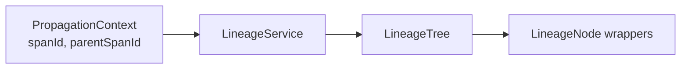
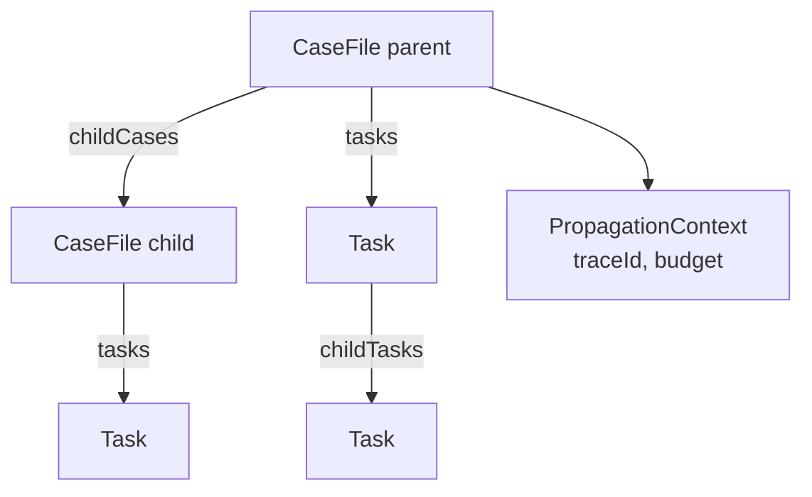

# Session 3: Getting the Architecture Right

**Date:** 2026-04-09
**Type:** phase-update

---

## How we improved from here

Two sessions had produced a working framework. The Blackboard control loop, CMMN stages and milestones, pluggable storage, a first Quarkus Flow connection. But looking at it with fresh eyes, three things weren't right: the graph model, the identity scheme, and the absence of goals. This session was about fixing all three before the code grew further in the wrong direction.

## Collapsing the graph and the data

The original design tracked lineage through `PropagationContext` — a separate object carrying `spanId`, `parentSpanId`, and `lineagePath`. To traverse the execution hierarchy you had to go through `LineageService`, which rebuilt a `LineageTree` from stored contexts. Filtering meant accessing `LineageNode` wrappers and looking up properties separately.

This is a legitimate design — a classic separation of graph structure from data, a natural starting point when building decoupled systems. If your domain of objects isn't fixed, keeping graph and data separate has real advantages: the graph machinery doesn't need to know anything about the data it connects.

But CaseFile and Task are fixed domain types. With a stable domain, the separation adds verbosity without benefit. There are ergonomic and aesthetic advantages to collapsing the graph and the data into a single structure — less indirection, less noise, more readable traversal. Think of how XPath works against HTML: the node content is right there, part of the model, and you traverse it naturally. Now imagine if it wasn't — every path expression would first have to fetch node content from a separate service before it could evaluate a predicate. The LineageService model was that second version.

**Before — lineage via indirection:**

**After — direct POJO graph:**

We replaced the entire model. `CaseFile` now carries `getParentCase()`, `getChildCases()`, and `getTasks()` directly. `Task` carries `getOwningCase()` and `getChildTasks()`. `LineageTree`, `LineageNode`, and `LineageService` are gone. `PropagationContext` still exists but as a slim value object — just `traceId` for OTel correlation, `inheritedAttributes`, and the budget fields. No graph backbone.

String IDs became `Long` primary keys — right for Hibernate `@Version` optimistic locking. The `UUID` stayed but only for OpenTelemetry correlation, not for graph edges.

## Persistence extracted properly

We pulled persistence into dedicated modules: `casehub-persistence-memory` for tests (zero external dependencies, fast, reset between runs) and `casehub-persistence-hibernate` for production (Panache entities, H2 for tests in PostgreSQL compatibility mode, PostgreSQL as the production target). `casehub-core` is now purely interfaces — one persistence module per backend, consistent with how Quarkus Flow organises its extensions.

The SPI interfaces — `CaseFileRepository`, `TaskRepository` — are the only contract the core cares about. Swap the module, swap the backend.

## Adding the goal model

The design document had a section called "Goals vs Tasks" with a decision: task-only for MVP, revisit in Phase 3. Phase 3 never arrived.

The consequence: `createAndSolve()` has no way to express what the caller actually wants. Cases complete on quiescence — when nothing more can fire. That conflates "nothing left to run" with "we achieved what we set out to do." They're not the same thing.

We did real research across the landscape of goal and planning models.

| Framework | Origin | Goal expressed as | Runtime dynamic | Shared state | Control reasoning | Multi-agent | CaseHub alignment |
|---|---|---|---|---|---|---|---|
| **GOAP** | Game AI | Predicate over world state | ✓ replans on change | ✓ world state | Backward-chains from goal | ✗ single agent | **Medium** — goal-as-predicate ✓, but single-agent planner not our model |
| **BDI** | Agent theory | Desire (goal) separate from Intention (plan) | ✓ revises beliefs, drops intentions | ✓ belief state | Agent's own deliberation | ✓ multi-agent | **High** — desire/intention separation maps directly to Goal/PlanItem |
| **HTN** | AI planning | Task decomposition — goals as tasks to achieve | ✗ plan generated upfront | ✓ preconditions/effects | Top-down task decomposition | ✗ | **Low** — task-centric, not state-predicate; CaseHub avoids goal-as-checklist |
| **DCR Graphs** | Business process research | Compliance conditions — obligations, exclusions | ✓ event-driven | ✓ activity marking | Reactive, declarative | ✗ | **Low-Medium** — compliance framing useful, not goal pursuit |
| **CMMN** | OMG standards | Milestones, sentries, lifecycle conditions | ✓ condition-driven | ✓ CaseFile | Sentry activation | Partial | **Medium-High** — vocabulary ✓✓, lifecycle ✓✓, control reasoning weak |
| **KAOS** | Requirements engineering | Formal goal hierarchy, AND/OR, obstacles | ✗ design-time only | Partial | Goal refinement + obstacle resolution | ✗ | **Low** — useful for requirements analysis, not a runtime model |
| **LangChain4j** | Java LLM framework | `outputKey` string — what the agent should produce | ✓ LLM-driven | ✓ AgenticScope ≈ CaseFile | LLM orchestration | ✓ | **Low-Medium** — CaseFile analogue exists, but goal concept too narrow |

The insight that keeps coming up across all these systems: a goal is a predicate over state, not a checklist of tasks that ran.

The BDI framing fits CaseHub best. A desire (the Goal) and an intention (the PlanItems executing TaskDefinitions) should be architecturally separate. If a goal is already satisfied before any work starts, don't plan anything. If it becomes impossible, drop it — don't let the case run indefinitely.

The design: a `CaseGoal` declared at `createAndSolve()` time, composed of named `Milestone`s, each a `Predicate<CaseFile>`. A `GoalEvaluator` runs in the control loop separately from task execution, testing satisfaction after each iteration. Cases without a Goal fall back to existing quiescence behaviour.

LangChain4j uses "Goal" to mean something narrower — an `outputKey` string. Using `Milestone` for intermediate states keeps the terminology clean and CMMN-aligned. The decision is in ADR-0001.

## Infrastructure and tracking

Session 3 also set up what should have existed from the start: GitHub repository, issue tracking, and a retrospective mapping of the work done so far. The design document was synced. ADR-0001 written and committed.

The goal model plan is written. Implementation starts next — though one more research topic first.
